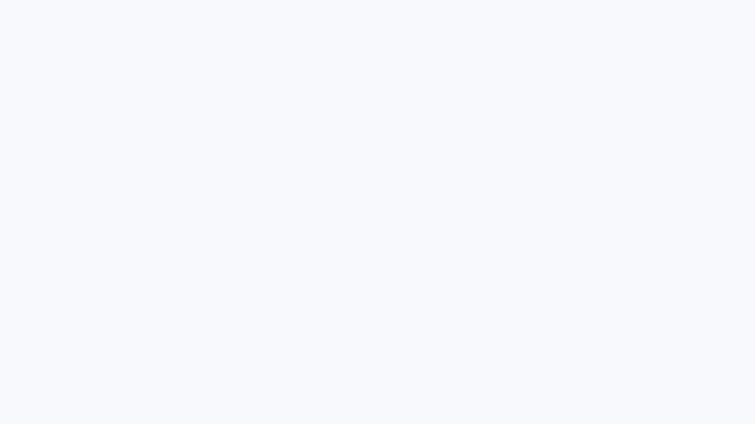

# Ferricket

Ferricket is a fast, file-native issue tracker for people and coding agents. The Cargo package is `ferricket`, the CLI is `fer`, and the source of truth is compatible Markdown in `.tickets/`—no database or daemon.

It includes an async Rust CLI, a keyboard-first terminal UI, and a Linear-style React web UI embedded in the same binary.

## Install

~~~sh
cargo install ferricket
~~~

This installs the `fer` executable into the Cargo bin directory, normally
`~/.cargo/bin`.

To build and install Ferricket from a source checkout instead:

~~~sh
make install
~~~

The source install builds the embedded frontend before installing `fer`.

## Start a workspace

~~~sh
cd your-project
fer init
fer create "Add authentication" --priority 1 --tags backend,security
fer create "Build login form" --parent fer-ab12
fer dep fer-ab12 fer-cd34
fer ready
~~~

`fer init [path]` creates only the `.tickets/` directory and fails if it already exists. It does not create or modify project guidance files. Existing ticket repositories work without initialization or migration.

Ferricket searches the current directory and its parents for `.tickets/`. Pass `--tickets-dir <path>` or set `TICKETS_DIR` to use an explicit location; the flag takes precedence. Ticket commands accept exact IDs or unambiguous partial IDs.

## Command-line help

~~~text
fer - minimal ticket system with dependency tracking

Usage: fer [--tickets-dir <path>] <command> [args]

Commands:
  init [path]                  Create .tickets (fails if it already exists)
  create [title] [options]     Create ticket, prints ID
    -d, --description          Description text
    --design                   Design notes
    --acceptance               Acceptance criteria
    -t, --type                 Type label [default: task; common: bug|feature|task|epic|chore]
    -p, --priority             Priority 0-4, 0=highest [default: 2]
    -a, --assignee             Assignee [default: git user.name]
    --external-ref             External reference (for example gh-123)
    --parent                   Parent ticket ID (hierarchy, not blocking)
    --tags                     Comma-separated tags
  start <id>                   Set status to in_progress
  close <id>                   Set status to closed
  reopen <id>                  Set status to open
  status <id> <status>         Set open, in_progress, or closed
  dep <id> <dep-id>            Add dependency (id depends on dep-id)
  dep tree [--full] <id>       Show prerequisite tree (--full disables dedup)
  dep cycle                    Find dependency cycles in non-closed tickets
  undep <id> <dep-id>          Remove dependency
  link <id> <id> [id...]       Link tickets symmetrically
  unlink <id> <target-id>      Remove a symmetric link
  ls|list [filters]            List tickets
  ready [filters]              List active tickets with dependencies resolved
  blocked [filters]            List active tickets with unresolved dependencies
  closed [--limit N] [filters] List recently closed tickets [default: 20]
  show <id>                    Display ticket and relationships
  add-note <id> [text]         Append timestamped note (or read stdin)
  edit <id>                    Open ticket in $EDITOR
  query [jq-predicate]         Select JSONL with a built-in jq-compatible predicate
  tui [path]                   Open the interactive terminal UI
  ui [path]                    Open the bundled web UI
  super <command> [args]       Bypass plugins and run a built-in command

Options:
  --tickets-dir <path>        Use an explicit tickets directory
  -V, --version                Print version
  -h, --help                   Print this help

List filters: --status X, -a/--assignee X, and -T/--tag X where supported.
Searches parent directories for .tickets (--tickets-dir overrides TICKETS_DIR).
Exact IDs take precedence; unambiguous partial IDs are accepted.
Run 'fer <command> --help' for command-specific options.
~~~

## Web UI

~~~sh
fer ui                       # current workspace, open browser
fer ui ../another-project    # explicit project or .tickets directory
fer ui --no-open             # print URL without opening it
fer ui --no-watch            # disable filesystem watching
~~~

The embedded React UI provides:

- grouped list, parent tree, draggable status board, staged dependency roadmap, and zoomable dependency DAG layouts;
- status-aware roadmap cards with focused connection tracing, plus an opt-in all-connections view;
- a full-screen canvas mode for the roadmap and DAG that hides the app shell and exits with `Esc`;
- a `/` ticket finder that jumps to a roadmap card or DAG node by ID, title, label, or assignee;
- a virtualized pan-and-zoom DAG with asynchronous worker layout, left-to-right or top-to-bottom direction, fit controls, minimap, and prerequisite-path focus;
- route-level, bookmarkable ticket details and raw-file views with copy/open actions;
- advanced visual and Gmail-style filters with suggestions;
- `Cmd+K`/`Ctrl+K` navigation and a collapsible shadcn sidebar;
- a Tiptap WYSIWYG editor with Notion-style `/` block commands and optional raw Markdown;
- editor attachments plus `@` people and `#` local-ticket/GitHub issue or pull-request suggestions;
- bulk updates, conflict-safe note creation/editing/deletion, searchable labels/parents/assignees, and file actions;
- persistent display/filter/view choices (including DAG direction) and light, dark, or system theme;
- revision/ETag checks that reject edits when a ticket changed on disk.

Insights includes synchronized ticket-state and throughput trends, a shared smart/custom date range,
automatic or minute-based bins, hover inspection, and drag-to-zoom across charts.

Live refresh watches only direct `.md` children of the resolved `.tickets` directory. It is enabled by default and can be paused in the UI. The resolved workspace path is shown in the sidebar.

Binding outside localhost exposes a write-capable API without authentication. Only do this on a trusted network:

~~~sh
fer ui . --host 0.0.0.0 --port 4173 --no-open
~~~

## Terminal UI

~~~sh
fer tui
fer tui ../another-project
fer tui --no-watch
~~~

The TUI ports the web display modes into terminal-native grouped, tree, board, staged roadmap, dependency DAG, and Insights views. Ticket scope (Active, All, Blocked, or Closed), layout, query, and details-pane preference persist per workspace. `Ctrl+P` searches tickets from the first character and runs navigation, creation, layout, saved-view, and live-update actions.

Vim navigation includes `h`/`j`/`k`/`l`, `gg`, `G`, `zz`, and `Ctrl+D`/`Ctrl+U`; column layouts use `h`/`l` between columns and `j`/`k` within them. The detail view supports back/forward history and navigable parents, sub-tickets, dependencies, dependents, and links. The TUI also provides live Gmail-style filters, multi-field creation, bulk status/priority changes, notes, and conflict-safe writes. Press `?` for the complete key map.

## Query syntax

The web Filter control and TUI `/` prompt use the same query language. Terms use AND by default; uppercase `OR`, braces, quoted values, negation, and `*` wildcards are supported.

~~~text
status:todo label:backend -assignee:unassigned
status:active {label:backend label:rust} -is:blocked
id:fer-* OR title:"Build filters"
has:children after:2026-07-01
~~~

Fields include `status:`, `priority:`, `type:`, `assignee:`, `label:`/`tag:`, `parent:`, `id:`, `title:`, `blocked:`, `before:`, `after:`, `created:`, `is:`, and `has:`. State predicates include `is:blocked|unblocked|ready|assigned|unassigned|subticket|top-level|parent`. Presence predicates include `has:children|deps|links|labels|description|notes|assignee|parent|design|acceptance|external-ref`. `assignee:me` resolves to the current Git user.

## Storage and compatibility

Tickets remain compatible `.tickets/*.md` files with YAML frontmatter. Existing repositories require no conversion. Workspace UI preferences live asynchronously in the user’s Ferricket config directory, keyed by the resolved `.tickets` path, so UI state does not modify ticket repositories.

Plugins named `fer-<command>` or `ticket-<command>` can extend or override commands. They receive `TICKETS_DIR` and `FER_SCRIPT`.

## Development

`web/dist` is embedded into `fer`. Rebuild and commit it after frontend changes; editable source lives in `web/src`.

Install the pinned Bun version from `mise.toml` before running the Make targets. Rustup automatically uses the Rust version and components pinned in `rust-toolchain.toml`.

~~~sh
mise install
~~~

~~~sh
make build      # frozen Bun install, frontend build, Rust build
make check      # frontend audit/format/types/tests/build + Rust fmt/tests/Clippy
make clean      # remove Cargo output and transient TypeScript build metadata
make install    # release-build and install fer into the local Cargo bin directory
make lock       # refresh workspace package versions in Cargo.lock for a release
make uninstall  # remove the locally installed fer binary
~~~

The install directory respects `CARGO_INSTALL_ROOT` or `CARGO_HOME` when either is configured.
Published releases contain the prebuilt web assets, so installing them does not require Bun.
`make clean` preserves the committed `web/dist` bundle, downloaded frontend dependencies, and
any `fer` executable already installed in the local Cargo bin directory.

See [AGENTS.md](AGENTS.md) for architecture and contribution rules.

## License

MIT
